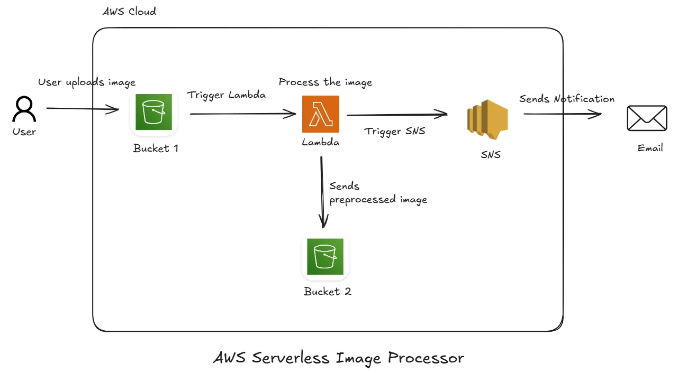

# AWS Serverless Image Processor

A fully serverless image processing pipeline on AWS! Upload an image to S3, automatically process it with lambda and store the result in another S3 bucket and receives an email notification via SNS. I built this project to solve real-world problems like automating image preprocessing in document verification and content platforms and mostly to learn practical knowledge about AWS :) 

## Architecture 

## Key Features
- Serverless architecture
- Image preprocessing using AWS Lambda
- S3 bucket integration for input/output storage
- Email notification via Amazon SNS
- No backend servers to manage

## Tech Stack
1. **AWS S3** - Storage for Raw and processed images
2. **AWS Lambda** - Image preprocessing logic
3. **AWS SNS** - Notification System
4. **Python** - Lambda Runtime
5. **Boto3** - AWS SDK for python

## Workflow
1. User uploads an image to bucket 1
2. S3 event triggers the lambda function when new object is created in S3.
3. Lambda process the image and upload it to bucket 2
4. Lambda also triggers the SNS notification with details.

## How to run/use the application
- As of now I haven't yet deployed it. So, we need to run it manually in local. 
**Steps to run locally**
1. Clone the repo 
2. Open in VSCode and use the environment setup for easy installation.
3. after setting up the environemnt;
    - RUN: 
        1. `make clean build zip` - To build the `lambda_func.zip` folder
        2. `make deploy` - Deploy the services and integrate them.
        3. Open a new terminal and run `make api` - This will run a fastapi endpoint 
        4. Go to `http://localhost:8000/upload` and pass this `{ "bucket_name": "bucket-1-5027", "filename": "/workspaces/assets/Architecture.webp", "key": "image.png" }` to start the process.
        5. You gonna receive a email shortly. 

Build by **M. Sanjay Uddith Raju** 